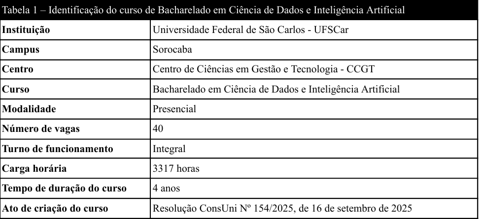
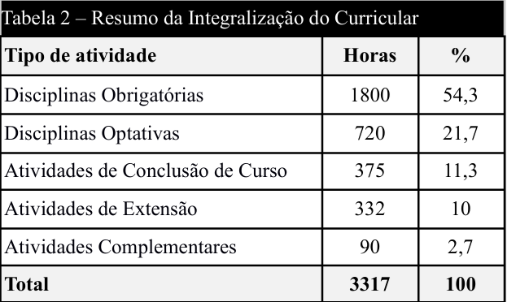

# Sobre o Curso
Essa é uma parte um pouco mais "técnica" mas de suma importância para entender sobre o curso que você ingressou ou pretende ingressar, tudo o que é falado aqui é retirado do Projeto Pedagógico do Curso que pode ser encontrado [aqui.](https://www.dcomp.ufscar.br/bacharelado-em-ciencia-de-dados-e-inteligencia-artificial/)
Aqui falaremos sobre sua estruturação, horas e sua matriz curricular.

## Estrutura
O curso de Dados e IA é oferecido pela Universidade Federal de São Carlos no campus de Sorocaba em modalidade presencial e tempo integral. Seu sistema de ingresso pelo SISU tem oferecido (até o momento) 40 vagas anuais com uma carga horária de 3317 horas com um tempo de duração padrão de 4 anos, podendo ser feito no máximo em 7 anos.

## Horas
O Curso é composto por 5 tipos de atividades que contém horas mínimas a fim de serem feitas para poder se graduar sendo elas:

### Disciplinas Obrigatórias
Essas são as que você tem de fazer independente de querer ou não, todas as disciplinas do primeiro semestre são todas obrigatórias, a partir do segundo começa a aparecer o próximo tipo de disciplina, mas antes de falar delas um adendo: algumas disciplinas são trancadas por outras, pois elas são pré-requisito, então para fazer elas precisa passar no pré-requisito (ou verificar as normas de quebra de pré-requisito junto à coordenação/PAC).

### Disciplinas optativas
Essas são disciplinas que em alguns semestres abrem para fazermos, nelas (normalmente) poderemos escolher entre algumas opções, um exemplo, no segundo semestre podemos escolher entre:
- Aplicação de IA generativa
- Empreendedorismo
- Libras
Optativas significa que você vai optar por qual delas fazer baseado no seus objetivos, mais disciplinas pode ser ofertadas ou menos podem ser, tudo depende da disponibilidade dos professores, existe atualmente uma discussão acadêmica em andamento sobre a possibilidade de cursar optativas do departamento de computação.
### Atividades de Extensão
São atividades que conectam a universidade com a sociedade. Diferente das aulas teóricas, a extensão foca em aplicar o conhecimento do curso para resolver problemas reais da comunidade ou realizar eventos abertos ao público. Na UFSCar, 10% da carga horária total do curso deve ser dedicada a essas atividades, que podem ser projetos sociais, cursos de curta duração ou eventos acadêmicos registrados.

### Atividades complementares
Essas são atividades que vocês fazem para enriquecer o currículo e sua formação profissional, seja cursos livres, participação em palestras, cursos de idiomas, etc
Tudo o que você fizer por fora que pode ser acrescentado no currículo, se encaixa aqui.

### Atividades de Conclusão de Curso
Esse é o último tipo de atividade, e como o nome diz, é o que precisa para "concluir o curso", podendo ser Iniciação à Pesquisa, Projeto de Pesquisa, Estágio Supervisionado ou Práticas Profissionais, por hora é algo que não merece tanta preocupação por ser algo do fim do curso

### Tabela de Resumo das Horas

  <a href="../materias/semestre-1" style="background-color: #2094f3; color: white; padding: 10px 22px; text-decoration: none; border-radius: 6px; font-weight: bold; font-family: sans-serif; font-size: 15px; box-shadow: 0 2px 4px rgba(0,0,0,0.1); transition: 0.3s;">
    Matérias ➔
  </a>

